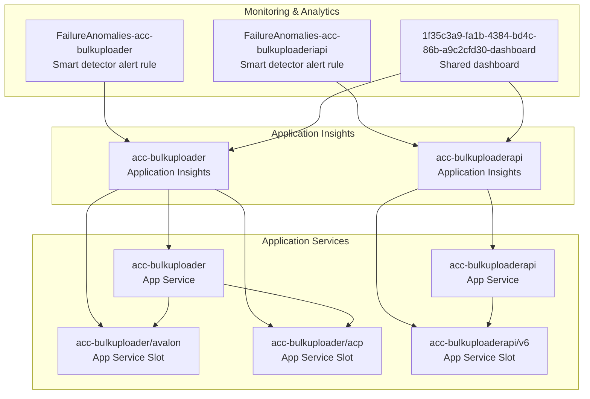

# BulkUploader Architecture Diagram

## System Overview

The BulkUploader system consists of multiple Azure resources including App Services, Application Insights, and supporting services for handling bulk upload operations.

## Architecture Diagram

## Component Details

### Smart Detector Alert Rules
- **FailureAnomalies-acc-bulkuploader**: Monitors the main bulk uploader service for anomalies
- **FailureAnomalies-acc-bulkuploaderapi**: Monitors the API service for anomalies

### Shared Dashboard
- **1f35c3a9-fa1b-4384-bd4c-86b-a9c2cfd30-dashboard**: Centralized monitoring dashboard for all services

### App Services
1. **acc-bulkuploader**: Main bulk upload service
   - **Slots**:
     - avalon: Likely a staging or testing slot
     - acp: Another deployment slot (possibly for A/B testing or blue-green deployment)

2. **acc-bulkuploaderapi**: API service for bulk upload operations
   - **Slots**:
     - v6: Version 6 deployment slot

### Application Insights
- **acc-bulkuploader**: Telemetry and monitoring for the main service
- **acc-bulkuploaderapi**: Telemetry and monitoring for the API service

## Data Flow

1. Both App Services are monitored by their respective Application Insights instances
2. Smart detector alert rules analyze the Application Insights data for anomalies
3. The shared dashboard aggregates monitoring data from both Application Insights instances
4. App Service slots allow for staged deployments and testing

## Key Architectural Patterns

- **Microservices**: Separate services for main functionality and API
- **Blue-Green Deployment**: Multiple slots for staged deployments
- **Monitoring First**: Comprehensive monitoring with Application Insights and smart alerts
- **Separation of Concerns**: API layer separated from main processing service